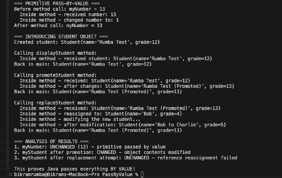

## Java Pass-by-Value Demonstration
A simple Java program that demonstrates how Java handles parameter passing for primitive types and object references.

**What it does**
This program shows three key concepts:

- **Primitive Pass-by-Value** - Modifications to primitive parameters don't affect the original variable
- **Object Content Modification** - Methods can modify object properties through reference parameters
- **Reference Reassignment** - Methods cannot change what the original reference points to

## How to run
**Prerequisites**
- Java 8 or higher
- Command line or IDE

**Running the program**
**Option 1: Command Line**
```bash
javac PassByValue.java
java PassByValue
```
**Option 2: IDE**

- Import the PassByValue.java file
- Run the main method

**Expected Output**
The program will demonstrate that Java passes everything by value, showing:

Primitive variables remain unchanged after method calls
Object contents can be modified through reference parameters
Reference reassignment attempts fail to affect the original variable

This proves Java's consistent pass-by-value behavior across all data types.
``